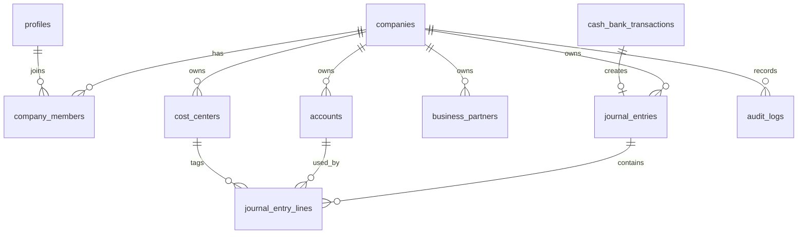

# Rancangan Schema Supabase Mini ERP

Tanggal rancangan: 2026-04-18

## Keputusan Dasar

Ya, Mini ERP ini bisa memakai Supabase saja. Untuk kebutuhan jangka panjang, Supabase/PostgreSQL lebih cocok dibanding Firestore karena data ERP bersifat relasional: company, user, role, COA, jurnal header, jurnal detail, cost center, kas/bank, approval, closing period, dan audit trail.

Target utama rancangan ini:

- Multi-company sejak awal, walaupun MVP baru memakai satu company.
- Semua tabel transaksi memiliki `company_id`.
- Data bisnis tidak dihapus fisik; gunakan `is_active`, `deleted_at`, dan `deleted_by`.
- Jurnal dipisah antara header dan lines agar Excel/Power Query mudah menarik data.
- Laporan Excel menarik dari `reporting` views, bukan dari tabel mentah.
- Role-based access disiapkan dengan Supabase Auth + RLS.

## Modul dan Tabel

### Core Tenant dan User

| Tabel | Fungsi |
|---|---|
| `companies` | Master company/tenant. |
| `profiles` | Profil user yang terhubung ke `auth.users`. |
| `company_members` | Hak akses user per company. Mendukung user yang punya role berbeda di company berbeda. |

Role awal:

- `owner`
- `admin`
- `accounting`
- `staff`
- `reader`

Permission tambahan disimpan di `company_members.extra_permissions`, misalnya `approval:self-approve`.

### Master Data

| Tabel | Fungsi |
|---|---|
| `business_partners` | Gabungan pelanggan/supplier/vendor. Field `partner_type` berisi `customer`, `supplier`, atau `both`. |
| `units` | Satuan produk/jasa. |
| `product_categories` | Kategori produk/jasa. |
| `products` | Produk atau jasa. |
| `cost_centers` | Cost center/departemen. |
| `accounts` | Chart of Accounts. |

Catatan: pelanggan dan supplier dibuat dalam satu tabel `business_partners` agar satu entitas bisa menjadi pelanggan sekaligus supplier tanpa duplikasi.

### Accounting dan Kas/Bank

| Tabel | Fungsi |
|---|---|
| `journal_entries` | Header jurnal. Status: `draft`, `posted`, `void`. |
| `journal_entry_lines` | Detail jurnal debit/kredit. |
| `cash_bank_transactions` | Draft/posted transaksi kas bank. Saat posted, membuat jurnal otomatis. |
| `accounting_period_locks` | Closing period per company dan periode bulan. |
| `approval_events` | Riwayat approval/reject/post/void per dokumen. |
| `audit_logs` | Audit trail generic, menyimpan before/after JSON. |

Aturan accounting penting:

- Satu baris jurnal tidak boleh punya debit dan kredit sekaligus.
- Jurnal posted wajib balance.
- Periode terkunci tidak boleh menerima posting, void, atau reversal.
- Posted transaction tidak diedit langsung; koreksi lewat void/reversal.
- Check balance lintas baris sebaiknya dipaksa via RPC seperti `post_journal_entry(...)`, bukan hanya constraint tabel.

## Relasi Inti



## Reporting untuk Excel

Schema `reporting` disiapkan khusus untuk Excel/Power Query:

| View | Fungsi |
|---|---|
| `reporting.vw_journal_lines` | Flat journal lines, cocok untuk Excel pivot. |
| `reporting.vw_buku_besar` | Buku besar per account dengan running balance. |
| `reporting.vw_trial_balance` | Neraca saldo. |
| `reporting.vw_profit_loss` | Laba rugi. |
| `reporting.vw_balance_sheet` | Neraca. |

Contoh query Excel:

```sql
select *
from reporting.vw_buku_besar
where company_id = '00000000-0000-0000-0000-000000000000'
  and journal_date between '2026-04-01' and '2026-04-30'
order by account_code, journal_date, journal_number, line_position;
```

Untuk production, jangan pakai user `postgres` di Excel. Ada dua opsi aman:

- Excel menarik data lewat Supabase API/OData-style endpoint dengan JWT user, sehingga RLS tetap jalan.
- Excel memakai database user read-only khusus, tetapi harus dibuatkan view/reporting role yang company-scoped dan diuji agar tidak bisa membaca tabel mentah.

Draft SQL memakai `security_invoker` pada reporting views agar akses dari aplikasi tetap mengikuti RLS tabel asal.

## Strategi Migrasi dari App Saat Ini

Mapping dari Firestore/localStorage saat ini:

| Saat Ini | Supabase |
|---|---|
| `companies/{companyId}` | `companies` |
| `companies/{companyId}/members` | `company_members` |
| `pelanggan` | `business_partners` dengan `partner_type = 'customer'` |
| `supplier` | `business_partners` dengan `partner_type = 'supplier'` |
| `produk` | `products` |
| `satuan` | `units` |
| `kategoriProduk` | `product_categories` |
| `costCenters` | `cost_centers` |
| `coaAccounts` | `accounts` |
| `journalEntries` | `journal_entries` + `journal_entry_lines` |
| `cashBankTransactions` | `cash_bank_transactions` |
| `periodLocks` | `accounting_period_locks` |
| `auditLogs` | `audit_logs` |

## Rekomendasi Implementasi

1. Buat Supabase project staging terlebih dahulu, bukan production.
2. Jalankan draft migration dari `supabase/migrations/202604180001_initial_erp_schema.sql` setelah review.
3. Buat seed company, owner, dan COA default.
4. Ubah service layer React dari Firebase/localStorage menjadi Supabase client.
5. Buat RPC untuk operasi accounting yang berisiko:
   - `approve_journal_entry`
   - `post_journal_entry`
   - `void_journal_entry`
   - `post_cash_bank_transaction`
   - `void_cash_bank_transaction`
   - `lock_accounting_period`
6. Buat user read-only untuk Excel dan expose hanya reporting views.

Status artefak staging yang sudah disiapkan:

- `supabase/migrations/202604180001_initial_erp_schema.sql`: schema, RLS, reporting views.
- `supabase/migrations/202604180002_bootstrap_company_seed.sql`: RPC bootstrap company, owner, COA default, cost center, satuan, kategori produk.
- `supabase/migrations/202604180003_accounting_rpcs.sql`: RPC approval, posting, void/reversal, lock/unlock period, audit/event write server-side.
- `supabase/tests/staging_reporting_smoke.sql`: query smoke test reporting untuk Excel/Power Query.
- `docs/SUPABASE-STAGING-RUNBOOK.md`: langkah menjalankan migration staging.

## Catatan Keamanan

RLS di SQL draft masih baseline. Sebelum live production, rules wajib diuji dengan skenario:

- Owner bisa akses company miliknya.
- Accounting hanya bisa approve/post sesuai permission.
- Staff tidak bisa melihat setting/user management.
- Reader hanya bisa membaca report.
- User company A tidak bisa membaca company B.
- Excel user hanya bisa membaca `reporting` views, bukan tabel transaksi mentah.

Tambahan hasil review awal:

- Tidak ada policy `DELETE` untuk tabel bisnis. Soft delete dilakukan lewat update `is_active`, `deleted_at`, dan `deleted_by`.
- Foreign key accounting memakai `ON DELETE RESTRICT`; journal lines tidak cascade-delete dari journal header.
- Relasi penting memakai composite foreign key `(company_id, id)` agar transaksi company A tidak bisa memakai akun/cost center/company-scoped record milik company B.
- `company_id` pada tabel company-scoped dibuat immutable lewat trigger.
- Direct update untuk journal/kas-bank hanya boleh pada draft. Approval, posting, void, dan reversal disiapkan lewat RPC dengan konteks `app.accounting_rpc_context`.
- Closing period lock/unlock juga lewat RPC agar audit trail tetap konsisten.
- Client tidak diberi insert policy ke `audit_logs` atau `approval_events`; event tersebut harus ditulis dari RPC/security-definer function atau service role.
